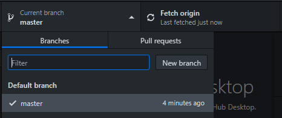
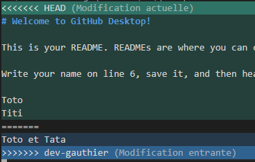
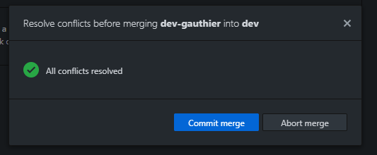

# Git introduction

## Before starting

1. Create a GitHub account: https://github.com/
2. Install an IDE if you don't already have one such as [Sublime text](https://www.sublimetext.com/3) or [Visual Studio Code](https://code.visualstudio.com)

## Objectives

This workshop is executed **in groups of 2-3 people**. At least 2 students must have a machine and a GitHub account.

1. Do the tutorial Github Desktop
1. Create a repository and clone it on your computer
1. Create a branch and navigate between branches
1. Modify a file of the repository and push the modifications
1. Manage conflicts

## Tutorial Github Desktop

- Launch Github Desktop
- Start the tutorial and follow the indications

## Repository creation and clone

One single member of the group creates the repository :

1. Connect to [Github.com](https://github.com)
1. From your home account, navigate to the page **"Your repositories"**
1. Click on the **"New"** button
   1. Choose a project name
   1. Check **"Add a README file"**
   1. Enable `.gitignore` by selecting any template such as `C++`
1. From your project page, go to **"Settings > Manage Access"**, click on **"Invite a collaborator"** and add your project's group memebers.

**All members** of the group clone the repository :

1. Open Github Desktop
1. Click on **"Clone a repository from the Internet"**
1. Provide the name for your project repository
1. Click on "Clone"
1. You know have a local copy of the repository on your machine

## Branch creation

**One member** of the group creates a branch, for instance `feat/awesome-feature` :

1. In Github Desktop : **Current branch > New branch**
   
1. Choose a branch name, eg `feat/awesome-feature`
1. Click on the **"Create branche"** button

You can know navigate (= checkout) between the `main` and `feat/awesome-feature` branches.

## Push the modifications and get the changes of your collaborators

**One member** of the group modifies the file `README.md` and pushes the changes to the branch `feat/awesome-feature` :

1. Completely modify the README.md file :
   1. Open the repository with your IDE
   1. Remplace all content of the README.md file
1. In Github Desktop :
   1. Choose a commit message ("Summary")
   1. "Commit to feat/awesome-feature"
   1. Use **"Publish branch"** to push your changes
   1. Create a **"Pull request"**

**The other members** of the group collect the changes :

1. Use **"Fetch origin"** to synchronise your local repository with the remote changes
1. Navigate to the branch `feat/awesome-feature` and observe your files change in your IDE

## Conflict handling

A conflict occures when one part of a file has been modified on 2 branches that have to merge. We are going to create a conflict in order to see how to reslove it.

**2 members** of the group each create one branch from `feat/awesome-feature` and modify the same part (same lines) of the README.md file :

1. Create one branch dev-name "based on... feat/awesome-feature"
1. Modify the README.md file
1. Commit changes
1. Push changes

**One after the other**, each member merges his branch on `feat/awesome-feature`:

1. Checkout the `feat/awesome-feature` branch
1. Click on **"Choose a branche to merge into feat/awesome-feature"**
1. Select the branch
1. Push your modifications 
1. The second group member will have a conflict :
   1. Open your IDE like Github Desktop indicates you
   1. The conflict materializes itself as follows :
      
   1. in order to solve the conflict, youb either keep the HEAD part, or the dev-name part and delete the other lines (including lines "====" and ">>>>")
   1. Once these lines have been deleted you can comit the merge from Github Desktop
      

## Redo the practical exercice with command lines

The objective is to redo the same actions as before with command lines.
You therefore must have a terminal and GIT installed by defaut on Linux or MacOS. 

For the installation :

- Windows : https://gitforwindows.org/
- Linux : https://git-scm.com/download/linux
- MacOS : https://git-scm.com/book/fr/v2/D%C3%A9marrage-rapide-Installation-de-Git

You can now open the terminal (on Linux or MacOS) or Git for Windows (on Windows).

You can find a detailed list of the different GIT commands in form of command lines under : 

- https://gist.github.com/aquelito/8596717
- https://github.github.com/training-kit/downloads/fr/github-git-cheat-sheet.pdf

